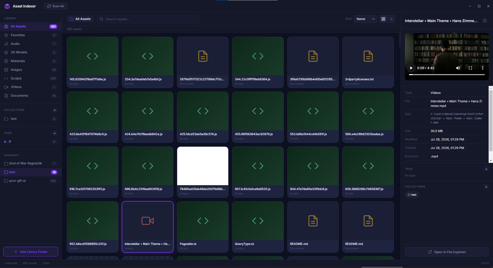

# Asset Indexer



Intelligent asset indexer for game developers. A desktop application to organize, browse, and manage game asset libraries with real-time file watching, rich previews, and powerful tagging and filtering capabilities.

## Features

- **Library Management** -- Add local folders as libraries, configure per-library ignore patterns via regex, and rescan on demand
- **Real-time File Watching** -- Automatic index updates when files are added, modified, or removed on disk
- **7 Asset Categories** -- 3D models, images, materials, audio, scripts, videos, and documents
- **Image Thumbnails** -- Direct file loading via `file://` protocol
- **Rich Previews** -- Images, audio with waveform visualization (Web Audio API), video playback, and code/text viewer
- **Tag System** -- Create custom-colored tags, assign to assets, and filter by tag
- **Collections** -- Group assets into named collections for project-based organization
- **Favorites** -- Star assets for quick access
- **Search and Filter** -- By name, category, library, tag, or collection
- **Sort Options** -- Name, size, modified date, or type
- **Grid and List Views** -- Toggle between visual grid and compact list layouts
- **Custom Frameless UI** -- Dark theme with purple accent

## Supported Formats

| Category | Extensions |
|---|---|
| 3D Models | `.fbx`, `.obj`, `.gltf`, `.glb`, `.blend`, `.3ds`, `.dae`, `.stl`, `.ply` |
| Images | `.png`, `.jpg`, `.jpeg`, `.tga`, `.tiff`, `.tif`, `.bmp`, `.gif`, `.psd`, `.hdr`, `.exr`, `.dds`, `.ktx`, `.webp`, `.ico` |
| Materials | `.mat`, `.material`, `.shader`, `.mtl` |
| Audio | `.wav`, `.mp3`, `.ogg`, `.flac`, `.aiff`, `.m4a`, `.wma` |
| Scripts | `.cs`, `.js`, `.ts`, `.py`, `.lua`, `.cpp`, `.h` |
| Videos | `.mp4`, `.avi`, `.mov`, `.wmv`, `.mkv`, `.webm` |
| Documents | `.pdf`, `.doc`, `.docx`, `.txt`, `.md`, `.rtf` |

## Tech Stack

| Layer | Technology |
|---|---|
| Framework | Electron 30.x |
| Language | JavaScript |
| Database | SQLite via better-sqlite3 |
| File Watching | Chokidar 3.6 |
| Build Tool | Vite + vite-plugin-electron |
| Packaging | electron-builder (NSIS installer) |
| UI | Vanilla HTML/CSS/JS, Inter font |

## Getting Started

### Prerequisites

- Node.js (v22 or later recommended)
- npm

### Installation

```bash
git clone https://github.com/manuel-di-iorio/asset-indexer.git
cd asset-indexer
npm install
```

### Development

```bash
npm run dev
```

Starts the Vite dev server with HMR and launches Electron.

### Production Build

```bash
npm run build
```

Vite builds the renderer and main process, then electron-builder packages a Windows NSIS installer in `dist/`.

## License

MIT
